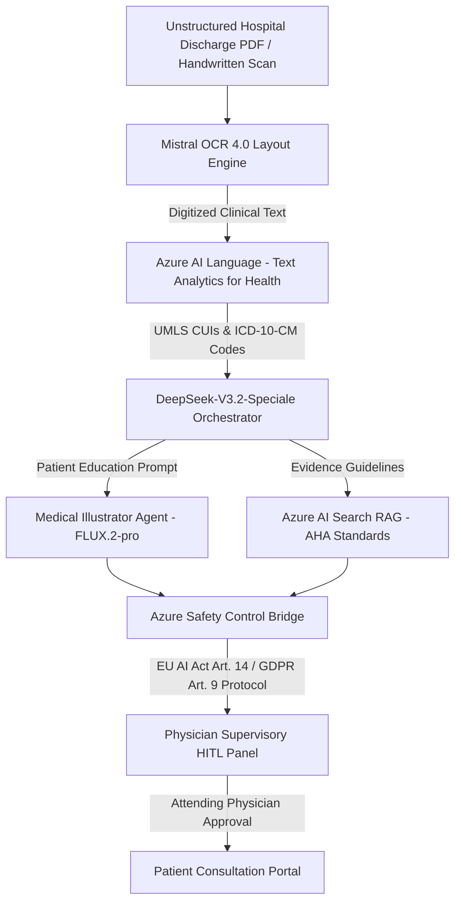
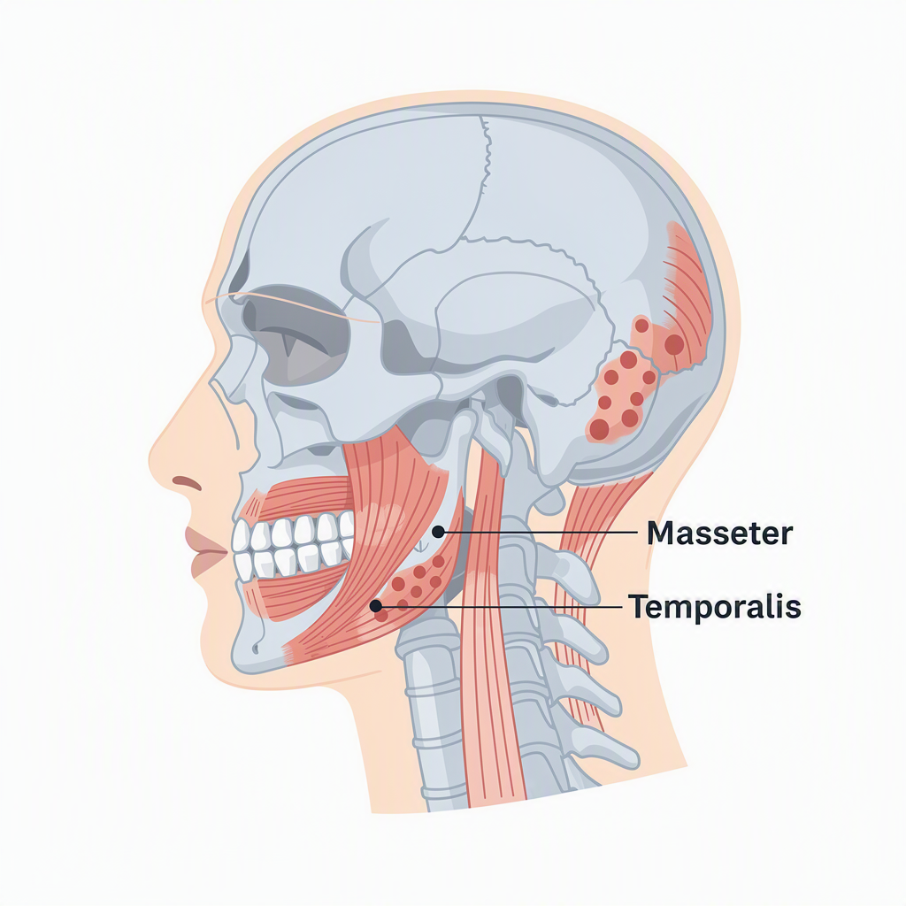

# OmniHealth AI: Legacy Document Synthesis & Patient Education Platform

[](https://azure.microsoft.com/)
[](https://mistral.ai/)
[](https://azure.microsoft.com/)
[](https://blackforestlabs.ai/)
[](https://ec.europa.eu/)

OmniHealth AI is an enterprise-grade **Multi-Agent Clinical AI Platform** built on the **Microsoft Agent Framework (MAF)**, **FastAPI**, **Azure AI Foundry**, and **React / Vite**. Designed specifically as a **Physician Decision Support System (HITL)** and **Patient Health Literacy Engine**, it automates the OCR digitization of unstructured hospital discharge PDFs, handwritten referral notes, and diagnostic lab reports, and synthesizes non-intimidating, flat-vector anatomical visual illustrations using **FLUX.2-pro** for bedside physician-patient consultation.

---

## 🔬 Clinical Architecture & Multi-Agent Workflow



### Multi-Agent Specialization (MAF Group Chat)

1. **Lead Medical Orchestrator (`DeepSeek-V3.2-Speciale / myagent`)**:
   - Manages workflow orchestration, normalizes unstructured clinical data, queries RAG indices for AHA guidelines, and synthesizes patient education summaries.
2. **Legacy Records Agent (`mistral-document-ai-2512`)**:
   - Parses handwritten referral notes, low-resolution hospital PDFs, and laboratory reports with layout preservation and multi-column OCR confidence scoring.
3. **Clinical NLP Agent (`Azure AI Language / Text Analytics for Health`)**:
   - Maps clinical entities to **UMLS CUIs** (Concept Unique Identifiers), **ICD-10-CM diagnostic codes**, and **ATC medication codes**.
4. **Medical Illustrator Agent (`FLUX.2-pro Text-to-Image`)**:
   - Generates non-intimidating, high-resolution 1024x1024 flat-vector anatomical diagrams suitable for patient education without graphic surgical imagery.
5. **Azure Safety Control Bridge**:
   - Enforces **EU AI Act Article 14** (Human Oversight) and **GDPR Article 9** (Health Data Processing) compliance guardrails before presenting recommendations.

---

## 🌟 Clinical Case Study: Patient #PX-8888 (Filippos-Paraskevas Zygouris)

### Case Overview
- **Patient ID**: `PX-8888`
- **Patient Name**: Filippos-Paraskevas (Philip) Zygouris
- **Age / Gender**: 24 | Male
- **Encounter Type**: Myofascial Clinical Evaluation Report
- **Primary Diagnosis**: Masticatory Myalgia & Jaw Muscle Strain
- **ICD-10-CM Code**: `M79.1` (Myalgia)
- **UMLS CUI**: `C0026848` / `C0221166`
- **Attending Physician**: Dr. Aris Nikolaidis

### Digitized Clinical Summary
> **PATIENT**: Zygouris Filippos-Paraskevas | **AGE**: 24 | **ADMISSION**: 2026-08-07.  
> **Primary Diagnosis**: Masticatory Myalgia (`ICD-10: M79.1`).  
> **Clinical Summary**: Localized pain and fatigue in muscles of mastication (masseter and temporalis) caused by prolonged static posture, high cognitive load, and nocturnal bruxism.

### Patient Education Summary
> *"Masticatory myalgia is muscle soreness in your chewing muscles (jaw and temples) caused by clenching teeth or muscle overuse. Your personalized visual aid shows the masseter and temporalis muscle groups and strain relief points."*

---

### 🎨 FLUX.2-pro Generated Anatomical Visual Aid (`PX-8888`)

Below is the **FLUX.2-pro** high-resolution flat-vector anatomical illustration generated live via Azure AI Foundry for Patient #PX-8888:

```
PROMPT SENT TO FLUX.2-PRO:
"Create a simple, non-intimidating, flat-vector medical illustration of the human head, jaw, and masseter temporalis masticatory muscles showing myofascial strain areas, suitable for patient education, clean white background."
```



*Figure 1: FLUX.2-pro Patient Education Diagram for Patient #PX-8888 (Filippos-Paraskevas Zygouris) illustrating masticatory muscle strain.*

---

## 📊 Complete Active Patient Database (11 Clinical Use Cases)

| Patient ID | Patient Name | Condition / Diagnosis | Record Type | ICD-10 | UMLS CUI | Status | FLUX.2-pro Illustration |
| :--- | :--- | :--- | :--- | :--- | :--- | :--- | :--- |
| **`PX-8810`** | Nikos Mavros | Coronary Artery Disease (85% LAD Stenosis) | Scanned Discharge PDF | `I25.10` | `C0010054` | `APPROVED` | Heart LAD Stenosis Vector |
| **`PX-8811`** | Elena Dimou | Lumbar Disc Displacement (L5-S1 Herniation) | Handwritten Referral Note | `M51.26` | `C0020440` | `APPROVED` | L5-S1 Spine Nerve Compression |
| **`PX-8812`** | Christos Papanikolaou | Type 2 Diabetes with Peripheral Neuropathy | Scanned Lab Report | `E11.40` | `C0011860` | `APPROVED` | Nerve Ending & Glucose Diagram |
| **`PX-8813`** | George Vassiliou | COPD Exacerbation & Emphysema | HRCT Chest Scan | `J44.1` | `C0024117` | `APPROVED` | Bronchial Airways & Alveoli |
| **`PX-8814`** | Maria Karrathana | Essential Primary Hypertension | Outpatient Clinic Note | `I10` | `C0020538` | `APPROVED` | Vascular Arterial Resistance |
| **`PX-8815`** | Stefanos Kostopoulos | Chronic Kidney Disease Stage 3 (CKD) | Renal Panel Lab Report | `N18.3` | `C0022658` | `APPROVED` | Kidney Nephron Filtration |
| **`PX-8816`** | Sophia Alexiou | Chronic Migraine / Vascular Headache | Neurology Referral | `G43.90` | `C0025202` | `APPROVED` | Cranial Nerve & Vessel Dilation |
| **`PX-8817`** | Ioannis Antoniou | Primary Knee Osteoarthritis | Orthopedic X-Ray Report | `M17.9` | `C0029408` | `APPROVED` | Knee Joint Cartilage Layer |
| **`PX-8818`** | Anna Papageorgiou | Acute Bronchial Pneumonia | ER Discharge Summary | `J18.9` | `C0032285` | `APPROVED` | Lung Fluid-Filled Alveoli |
| **`PX-8819`** | Eleni Papadaki | Acute L4-L5 Lumbar Disc Extrusion | Lumbar MRI Scan PDF | `M51.16` | `C0020440` | `APPROVED` | L4-L5 Disc Extrusion Vector |
| **`PX-8888`** | Filippos Zygouris | Masticatory Myalgia & Jaw Muscle Strain | Myofascial Clinical Report | `M79.1` | `C0026848` | `APPROVED` | Jaw & Masseter Muscle Vector |

---

## ⚡ Technology Stack

### Backend
- **Framework**: Python 3.11+, FastAPI, PyDantic v2, Uvicorn
- **AI Orchestration**: Microsoft Agent Framework (MAF), Server-Sent Events (SSE)
- **Azure AI Foundry Model Endpoints**:
  - `DeepSeek-V3.2-Speciale` (`myagent` orchestration endpoint)
  - `Mistral OCR 4.0` (`mistral-document-ai-2512` layout engine)
  - `FLUX.2-pro` (`blackforestlabs/v1/flux-2-pro` text-to-image)
  - `Azure AI Language / Text Analytics for Health`
  - `Azure AI Search` (AHA RAG Knowledge Base)

### Frontend
- **Framework**: React 18, Vite 5, Vanilla CSS Design System
- **Icons**: Lucide React
- **Typography**: Inter & JetBrains Mono (Clinical High-End Dark Glassmorphism)

---

## 🚀 Installation & Setup

### 1. Prerequisites
- Python 3.11 or higher
- Node.js 18+ and npm
- Azure AI Foundry API Key

### 2. Environment Configuration
Create a `.env` file in the root directory:

```env
AZURE_OPENAI_API_KEY=<YOUR_AZURE_AI_FOUNDRY_API_KEY>
AZURE_AGENT_ENDPOINT=https://wwefilip56-9387-resource.services.ai.azure.com/api/projects/wwefilip56-9387/agents/myagent/endpoint/protocols/openai/responses?api-version=v1
MISTRAL_OCR_ENDPOINT=https://wwefilip56-9387-resource.services.ai.azure.com/providers/mistral/azure/ocr
FLUX_PRO_ENDPOINT=https://wwefilip56-9387-resource.services.ai.azure.com/providers/blackforestlabs/v1/flux-2-pro?api-version=preview
```

### 3. Start Backend Server
```bash
# Install dependencies
pip install -r requirements.txt

# Run FastAPI Server (Port 8000)
python -m uvicorn core.api:app --port 8000 --reload
```

### 4. Start Frontend Dashboard
```bash
# Navigate to UI folder
cd ui

# Install dependencies
npm install

# Start Vite Development Server (Port 3000)
npm run dev
```

Access the React dashboard at `http://localhost:3000` and the API documentation at `http://localhost:8000/docs`.

---

## 🛡️ Regulatory & Safety Compliance

OmniHealth AI incorporates a dedicated **Safety Control Bridge** adhering to international healthcare AI standards:
- **EU AI Act Article 14**: Mandates Human-in-the-Loop (HITL) attending physician review before any AI recommendation or patient disclosure.
- **GDPR Article 9**: Enforces strict audit trails for special category sensitive medical health data.
- **AHA Health Literacy Standards**: Restricts generated illustration prompts to non-intimidating, flat-vector graphics without graphic surgical details.

---

## 📝 License

Distributed under the MIT License. See `LICENSE` for details.
