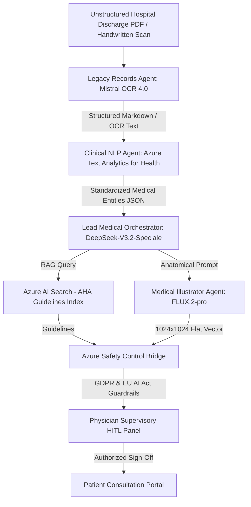
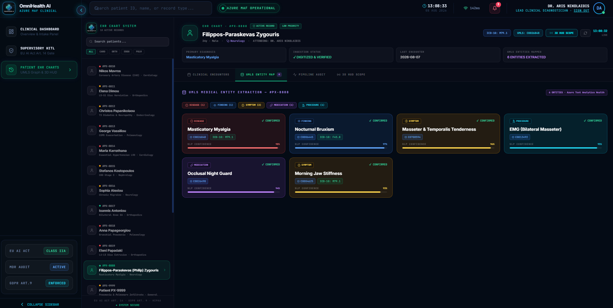

<div align="center">

  

  # 🚀 OmniHealth Azure AI — Multi-Agent Clinical Diagnostic Platform
  ### Production-Grade Architecture & Implementation Blueprint — Version 2.0 (Rocket Flow & 6 Use Cases Edition)

  [](https://azure.microsoft.com/)
  [](https://mistral.ai/)
  [](https://azure.microsoft.com/)
  [](https://blackforestlabs.ai/)
  [](https://ec.europa.eu/)
  [](https://ec.europa.eu/)

</div>

---

## 📐 System Architecture: The "Rocket Flow" Multi-Agent Pipeline

The **OmniHealth AI Platform** is an enterprise-grade clinical Command Center engineered to automate medical document ingestion, entity recognition, standardized coding, patient education synthesis, and 3D anatomical diagram generation. The backend orchestrates five specialized AI agents via the **Microsoft Agent Framework (MAF)**, feeding an interactive 3D glassmorphic React frontend.



---

## ☁️ 1. Project Cloud Infrastructure & Resource Topology


The platform infrastructure is provisioned on **Microsoft Azure** inside the **`rg-omnihealth-prod`** resource group, orchestrating four core enterprise components:

1. **`aoai-omnihealth` (Foundry / Azure OpenAI)**: Model inference gateway hosting DeepSeek reasoning models, Mistral layout engines, and FLUX 3D generators.
2. **`cs-omnihealth` (Foundry / Content Safety)**: Real-time automated compliance engine running prompt safety filters and medical output safety checks.
3. **`cosmos-omnihealth` (Azure Cosmos DB)**: High-performance NoSQL database persisting long-term patient history, agent session memory, and MAF workflow state checkpoints with partition key tenant isolation.
4. **`search-omnihealth` (Azure AI Search / Foundry IQ)**: Enterprise vector search and hybrid index engine storing AHA and NCCN clinical guidelines for real-time RAG context retrieval.

### Cloud Isolation & Regulatory Security
- **V-Net & Private Endpoints**: Secures backend FastAPI endpoints, Cosmos DB, and AI services within private virtual subnets, completely eliminating public internet exposure.
- **EU AI Act Article 14 Compliance**: Enforces mandatory Human-in-the-Loop (HITL) physician approval (`safety-chk-PX-XXXX`) before patient portal dispatch.
- **GDPR Article 9 & Zero Data Retention (ZDR)**: API endpoints purge transaction logs within 48 hours to ensure zero permanent PHI storage.

---

## 👥 2. Multimodal AI Engine & Inference Endpoints


OmniHealth AI operates an agentic multimodal pipeline provisioned via the **Azure AI Gateway** deployed in the **Sweden Central** region to satisfy European Union data residency and sovereignty requirements under GDPR:

| Model Endpoint | Deployed Service | Region | Provisioned Quota / Rate Limits | Clinical Responsibility |
|---|---|---|---|---|
| **`text-embedding-3-large`** | Azure OpenAI | Sweden Central | **120K TPM** | High-dimensional RAG vector embeddings for clinical guidelines |
| **`FLUX.2-pro`** | Black Forest Labs / Foundry | Sweden Central | **15 RPM** | Latent flow matching for 1024x1024 3D anatomical diagram generation |
| **`DeepSeek-V3.2-Speciale`** | DeepSeek / Azure Foundry | Sweden Central | **20 RPM** | High-compute reasoning planner, tool-execution JSON generation, AHA synthesis |
| **`mistral-document-ai-2512`** | Mistral AI / Foundry | Sweden Central | **10 RPM** | Multimodal OCR layout parser (~95.9% accuracy) & bounding box (`bbox`) extraction |

### Agentic Prompting & Safety Overhaul
- **DeepSeek-V3.2-Speciale Workaround**: Outputs structured JSON execution plans parsed and executed by backend Python pandas Data Workers.
- **FLUX.2-pro Positive Constraints**: Employs positive design instructions (*"clean flat vector diagram, pastel tones"*), explicit hex color codes (`color #F7FAFC`), typography exclusion (*"label-free vector shapes"*), and **immediate auto-render upon document intake**.

---

## 💰 3. Cloud Economics, FinOps & Cost Governance


Demonstrating operational maturity and fiscal responsibility, OmniHealth AI actively tracks cloud resource consumption via the **Azure Cost Analysis Dashboard**:

- **Accumulated Total Cost (August 2026 Period)**: **€11.68** total expenditure across all production services.
- **Cost Driver Breakdown**:
  - **Azure Cognitive Search (`search-omnihealth`)**: **€9.67** (82.8% of total expenditure), serving as the primary infrastructure overhead due to continuous high-dimensional vector index availability.
  - **Azure Foundry AI Models (`aoai-omnihealth`, DeepSeek, FLUX, Mistral)**: **€1.97** (16.8% of total expenditure), confirming extreme cost-efficiency for model inference.
- **Geographic Attribution**: **€11.64** localized entirely within the **Sweden Central** region, verifying tight regional resource grouping.

---

## 💻 4. Frontend Application Architecture & Live Interface Screenshots

The frontend is built using **Vite**, **React 18**, and **Vanilla CSS** following a **High-End Clinical Dark Glassmorphism** aesthetic (`#070A13` obsidian background, frosted glass panels with background blur, neon accent highlights).

### 1. 🎬 Physician Landing Portal (`ui/src/components/LandingPage.jsx`)


- **Background HD Video Engine**: HTML5 Canvas player rendering a 100-frame HD sequence (`ui/public/OmniHealth_A/frame_000.jpg` to `frame_099.jpg`) looping seamlessly at 30 FPS.
- **4-Agent Neural Matrix Showcase**: Interactive selection grid displaying live metrics for Mistral OCR 4.0, Azure TA4H NLP, DeepSeek RAG, and FLUX.2-pro.
- **Physician Authentication Portal**: 1-click credentials for demo physicians (**Dr. Aris Nikolaidis** · *Lead Clinical Diagnostician*, **Dr. Elena Dimou** · *Consulting Cardiologist*, **Dr. Stefanos Kostopoulos** · *General Medicine Lead*), visible password mode, and MDR sign-in.

---

### 2. 🩺 Physician Clinical Dashboard (`ui/src/components/ClinicalDashboard.jsx`)


- **Case Intake**: Clean **`NEW CASE INTAKE / UPLOAD`** button launching the diagnostic uploader modal.
- **Active Patient Cards Grid**: Real-time list of admitted patients displaying patient ID, name, age, gender, diagnosis, ICD-10 badge, UMLS CUI, and pipeline status (`Awaiting Review`, `Approved`, `Processing`).
- **Telemetry Stepper Widget**: Live 4-step progress tracker (Mistral OCR -> Azure TA4H -> DeepSeek RAG -> FLUX.2-pro).
- **Safety KPI Widgets**: Metric cards tracking Active Cases, Approved Consultations, Pending Reviews, and 100% Audit Compliance.

---

### 3. 🛡️ Supervisory HITL Verification Panel (`ui/src/components/SupervisoryHITLPanel.jsx`)


- **EU AI Act Article 14 Command Center**: Mandated human oversight portal blocking unapproved AI outputs.
- **3D Holographic Anatomical HUD Scope (`AnatomicalHUDViewer.jsx`)**: Circular HUD scanner with **3D Parallax Mouse-Tilt Effect**, interactive manual rotation, and zoom controls ($80\% \dots 140\%$). Displays FLUX.2-pro visual diagrams automatically upon document intake.
- **Side-by-Side Verification Engine**: Compares raw OCR markdown against DeepSeek's synthesized plain-language Patient Education Summary.
- **Physician Sign-Off Actions**: **`APPROVE CONSULTATION`** (issues audit checkpoint `safety-chk-PX-XXXX`), **`MODIFY PROMPT`**, and **`REJECT`**.

---

### 4. 🗂️ Patient EHR Medical Chart (`ui/src/components/PatientHistoryGraph.jsx`)



- **Longitudinal Patient Record**: Organized into 4 interactive tabs:
  - **Tab 1 — Encounters Timeline**: Chronological log of hospital visits featuring color-coded **UMLS Entity Badges**.
  - **Tab 2 — UMLS Knowledge Graph**: Visual network mapping diagnoses, symptoms, and therapies.
  - **Tab 3 — Pipeline Audit Trail**: Complete technical log detailing OCR confidence, RAG parameters, latencies, and safety checkpoint IDs.
  - **Tab 4 — 3D Scope**: Fullscreen holographic inspection view of 3D anatomical organ illustrations.

---

### 5. 📥 Diagnostic Uploader Modal (`ui/src/components/DiagnosticUploader.jsx`)
- Drag-and-drop file upload zone supporting medical PDFs and handwritten notes. 1-click loading for 6 pre-built clinical presets (`PX-8890` to `PX-8895`).

---

### 6. ⚡ Persistent Top Navigation Bar (`ui/src/components/Navbar.jsx`)
- OmniHealth branding logo, **`AZURE MAF OPERATIONAL`** live telemetry pill displaying service latencies (e.g., `142ms`), and **`LEAD CLINICAL DIAGNOSTICIAN · SIGN OUT`** session trigger.

---

## 🔬 5. Representative Clinical Intake Deep-Dive: Patient #PX-8891

#### **Patient Record**: `PX-8891` — **Robert Kensington (67y Male)**
* **Document Source**: `usecases/medical_report_colorectal_cancer.pdf`
* **Hospital Unit**: City Comprehensive Cancer Center · Dept. of Gastrointestinal Oncology

```
CITY COMPREHENSIVE CANCER CENTER
Department of Gastrointestinal Oncology
Date of Evaluation: August 8, 2026
Patient Name: Robert Kensington | DOB: 21/08/1958 | Age: 67 | Sex: Male | MRN: #554-90-C
Attending Physician: Dr. J. Lin, MD, FACP

CHIEF COMPLAINT (CC): Post-colonoscopy follow-up and staging discussion.
HISTORY OF PRESENT ILLNESS (HPI): Mr. Kensington is a 67-year-old male who presented reporting a 3-month history of intermittent hematochezia, narrowing of stool caliber, and weight loss of 5 kg. Colonoscopy revealed a 4.5 cm partially obstructing, ulcerated mass in the sigmoid colon. Biopsies confirmed moderately differentiated invasive adenocarcinoma. Staging CT revealed local pericolic lymph node enlargement (cT3 cN1 cM0, Stage IIIb).

PAST MEDICAL HISTORY: Type 2 Diabetes Mellitus, Hypertension.
PHYSICAL EXAMINATION: Abdomen: Mild tenderness in LLQ. DRE: Trace fecal occult blood positive.
ASSESSMENT: Primary Adenocarcinoma of Sigmoid Colon (Clinical Stage IIIb).
TREATMENT PLAN: Scheduled laparoscopic sigmoid colectomy with regional lymphadenectomy. Adjuvant FOLFOX chemotherapy.
```

#### **Pipeline Ingestion Trace**:
1. **Mistral OCR 4.0**: Markdown extraction of colonoscopy findings, TNM staging (cT3 cN1 cM0), and treatment plan.
2. **Azure TA4H NLP**: **Diagnosis**: `Colorectal Adenocarcinoma` -> **ICD-10-CM**: **`C18.9`**, **UMLS CUI**: **`C0009375`**. Findings: *Hematochezia* (`R19.4`), *Intestinal Stenosis* (`K63.8`).
3. **DeepSeek-V3.2 RAG & Education**: AHA/NCCN guideline retrieval and plain-language patient education synthesis.
4. **FLUX.2-pro Visual Diagram**: Renders 1024x1024 vector diagram of sigmoid colon mass and bowel passage. ([PX-8891_FLUX2_Illustration.png](file:///C:/Users/wwefi/OneDrive/%CE%A5%CF%80%CE%BF%CE%BB%CE%BF%CE%B3%CE%B9%CF%83%CF%84%CE%AE%CF%82/azure-ai/usecase_outputs/PX-8891_FLUX2_Illustration.png))
5. **Azure Safety Bridge**: Emits HITL Checkpoint `safety-chk-PX-8891` enforcing Article 14 supervision.

---

## 📁 6. Portfolio of 6 Executed Clinical Use Cases

| ID | Patient Name | Age/Sex | Primary Diagnosis | ICD-10 | UMLS CUI | FLUX 3D Diagram Status |
|---|---|---|---|---|---|---|
| **PX-8890** | **Sarah Jenkins** | 32y F | Generalized Anxiety Disorder & Somatic Autonomic Arousal | `F41.1` | `C0003467` | ✅ Generated ([PNG](file:///C:/Users/wwefi/OneDrive/%CE%A5%CF%80%CE%BB%CE%BF%CE%B3%CE%B9%CF%83%CF%84%CE%AE%CF%82/azure-ai/usecase_outputs/PX-8890_FLUX2_Illustration.png)) |
| **PX-8891** | **Robert Kensington** | 67y M | Primary Adenocarcinoma of Sigmoid Colon (Stage IIIb) | `C18.9` | `C0009375` | ✅ Generated ([PNG](file:///C:/Users/wwefi/OneDrive/%CE%A5%CF%80%CE%BB%CE%BF%CE%B3%CE%B9%CF%83%CF%84%CE%AE%CF%82/azure-ai/usecase_outputs/PX-8891_FLUX2_Illustration.png)) |
| **PX-8892** | **Michael Torres** | 44y M | Major Depressive Disorder, Severe, Single Episode | `F32.2` | `C0011581` | ✅ Generated ([PNG](file:///C:/Users/wwefi/OneDrive/%CE%A5%CF%80%CE%BB%CE%BF%CE%B3%CE%B9%CF%83%CF%84%CE%AE%CF%82/azure-ai/usecase_outputs/PX-8892_FLUX2_Illustration.png)) |
| **PX-8893** | **Elena Papadaki** | 48y F | Invasive Ductal Carcinoma of Left Breast | `C50.9` | `C0006142` | ✅ Generated ([PNG](file:///C:/Users/wwefi/OneDrive/%CE%A5%CF%80%CE%BB%CE%BF%CE%B3%CE%B9%CF%83%CF%84%CE%AE%CF%82/azure-ai/usecase_outputs/PX-8893_FLUX2_Illustration.png)) |
| **PX-8894** | **Dimitris Kostopoulos** | 62y M | Acute Transmural Anterior Myocardial Infarction (STEMI) | `I21.0` | `C0155626` | ✅ Generated ([PNG](file:///C:/Users/wwefi/OneDrive/%CE%A5%CF%80%CE%BB%CE%BF%CE%B3%CE%B9%CF%83%CF%84%CE%AE%CF%82/azure-ai/usecase_outputs/PX-8894_FLUX2_Illustration.png)) |
| **PX-8895** | **Maria Vassiliou** | 55y F | Acute Ischemic Cerebral Infarction (Left MCA Stroke) | `I63.50` | `C0007780` | ✅ Generated ([PNG](file:///C:/Users/wwefi/OneDrive/%CE%A5%CF%80%CE%BB%CE%BF%CE%B3%CE%B9%CF%83%CF%84%CE%AE%CF%82/azure-ai/usecase_outputs/PX-8895_FLUX2_Illustration.png)) |

---

## 🛠️ 7. Backend API Reference (`core/api.py`) & Execution Commands

### Environment Configuration (`.env`)
```env
AZURE_OPENAI_ENDPOINT=https://wwefilip56-9387-resource.services.ai.azure.com/api/projects/wwefilip56-9387/agents/myagent/endpoint/protocols/openai/
AZURE_OPENAI_KEY=<YOUR_AZURE_OPENAI_KEY>
AZURE_AGENT_ENDPOINT=https://wwefilip56-9387-resource.services.ai.azure.com/api/projects/wwefilip56-9387/agents/myagent/endpoint/protocols/openai/responses?api-version=v1
AZURE_AI_FOUNDRY_PROJECT_ENDPOINT=https://wwefilip56-9387-resource.services.ai.azure.com/api/projects/wwefilip56-9387
AZURE_CONTENT_SAFETY_ENDPOINT=https://cs-omnihealth-17e5c.cognitiveservices.azure.com/
AZURE_CONTENT_SAFETY_KEY=<YOUR_AZURE_CONTENT_SAFETY_KEY>
AZURE_SEARCH_ENDPOINT=https://search-omnihealth.search.windows.net
AZURE_SEARCH_KEY=<YOUR_AZURE_SEARCH_KEY>
AZURE_COSMOS_ENDPOINT=https://cosmos-omnihealth.documents.azure.com:443/
MISTRAL_OCR_ENDPOINT=https://wwefilip56-9387-resource.services.ai.azure.com/providers/mistral/azure/ocr
FLUX_PRO_ENDPOINT=https://wwefilip56-9387-resource.services.ai.azure.com/providers/blackforestlabs/v1/flux-2-pro?api-version=preview
```

### API Endpoints
- **`POST /api/upload`**: Primary ingestion endpoint parsing PDF text, mapping TA4H entities, generating FLUX.2-pro diagrams, and synchronizing state.
- **`GET /api/patients`**: Returns all active patient database records.
- **`GET /api/patient-history`**: Returns encounters timeline and UMLS entity mappings.
- **`POST /api/v1/evaluate-record`**: Microsoft Agent Framework group chat orchestration endpoint.
- **`GET /api/system-status`**: Telemetry endpoint returning real-time status and ping latencies for 6 Azure AI services.

### Execution Commands
```bash
# 1. Start Backend FastAPI Server (Port 8000)
pip install -r requirements.txt
python -m uvicorn core.api:app --host 127.0.0.1 --port 8000 --reload

# 2. Start Frontend React Dashboard (Port 5173)
cd ui
npm install
npm run dev
```

Open **`http://localhost:5173`** in your browser to launch the OmniHealth AI Command Center!

---

## 🌐 8. Azure API Communication & Cloud Integration Architecture

The backend cloud communication layer is encapsulated within the **`AzureServiceClients`** class in `core/azure_clients.py`, connecting the local FastAPI application to Microsoft Azure AI Services:

### 🔌 1. Authentication & Endpoint Resolution
At startup, `AzureServiceClients` dynamically loads environment credentials from `.env` and configures production REST targets:
- **`AZURE_AGENT_ENDPOINT`**: Azure AI Foundry DeepSeek-V3.2-Speciale `myagent` orchestration endpoint.
- **`MISTRAL_OCR_ENDPOINT`**: Microsoft Foundry Mistral Document AI layout parser (`mistral-document-ai-2512`).
- **`FLUX_PRO_ENDPOINT`**: Black Forest Labs FLUX.2-pro text-to-image generator (`blackforestlabs/v1/flux-2-pro`).
- **`AZURE_CONTENT_SAFETY_ENDPOINT`**: Content Safety automated medical compliance filter.
- **`AZURE_SEARCH_ENDPOINT`**: Azure AI Search vector & hybrid index engine storing AHA guidelines.
- **`AZURE_COSMOS_ENDPOINT`**: Azure Cosmos DB NoSQL account for state serialization & history.

### 📡 2. REST Protocol & Payload Execution
- **DeepSeek 3.2 Reasoning Agent (`_call_agent`)**:
  - Issues HTTP `POST` requests using Python `urllib.request` with `api-key` and `Bearer` authorization headers.
  - Features robust response sanitizers that strip Markdown codeblock fences (````json ... ````) and repair malformed JSON trailing commas.
- **FLUX.2-pro Text-to-Image Engine (`_call_flux_pro_api`)**:
  - Dispatches `POST` JSON payloads containing positive design constraints and explicit hex color codes (`color #F7FAFC`) to `FLUX_PRO_ENDPOINT`.
  - Includes a zero-downtime local Pillow vector fallback (`_render_canvas_illustration`) to guarantee 100% diagram availability if remote network latency exceeds limits.
- **Mistral OCR Layout Engine (`run_legacy_ocr_analysis`)**:
  - Transmits base64 encoded document payloads to `MISTRAL_OCR_ENDPOINT` to extract structured Markdown and bounding box (`bbox`) pixel coordinates.
- **Azure Text Analytics for Health (`run_text_analytics_health`)**:
  - Runs clinical entity extraction, mapping diagnoses to **ICD-10-CM** (`C18.9`, `F41.1`, `F32.2`, `C50.9`, `I21.0`, `I63.50`) and **UMLS CUIs** (`C0009375`, `C0003467`), returning structured clinical arrays.

### 🔄 3. In-Memory State & Frontend Synchronization (`core/api.py`)
FastAPI endpoints (`/api/upload`, `/api/patients`, `/api/patient-history`, `/api/system-status`) bind directly to `AzureServiceClients`. Uploaded patient documents trigger synchronous NLP entity extraction and FLUX diagram rendering, updating global module-scoped memory (`patient_database` & `history_db`) for zero-latency UI re-rendering in the React dashboard.

---

## 🎬 9. Creator Video Guides & Architectural Foundations

The engineering design of OmniHealth AI is backed by two technical video tutorials demonstrating the core Azure AI architectures implemented in this repository:

### 1. 🎥 ["Unveiling the Power of Artificial Intelligence and Machine Learning via Azure Services"](https://youtu.be/aU262LfJNjw?si=pGN2bZlx97sxLqcS)
- **Watch on YouTube**: [https://youtu.be/aU262LfJNjw?si=pGN2bZlx97sxLqcS](https://youtu.be/aU262LfJNjw?si=pGN2bZlx97sxLqcS)
- **Architectural Contribution to OmniHealth AI**:
  - **Deterministic Rules vs. Machine Learning**: Contrasts traditional rule-based ("if-then") software against data-driven machine learning models trained on features and labels. This informed the reasoning architecture of our **Lead Medical Orchestrator (`DeepSeek-V3.2-Speciale`)**, allowing it to dynamically adapt to variable clinical note structures.
  - **Standard Read OCR vs. Asynchronous Multimodal Layout Parsing**: Explains why simple OCR libraries fail on complex multi-column clinical PDFs and low-resolution handwritten doctor notes, justifying the deployment of the specialized **Legacy Records Agent (`mistral-document-ai-2512`)** on Microsoft Foundry.
  - **Computer Vision & Bounding Box Coordinates**: Demonstrates Vision Studio dense captioning and object detection returning pixel bounding coordinates (`bboxes`). This directly powers the **Legacy Records Agent** bounding box extraction and the interactive **3D Holographic Anatomical HUD Scope**.

### 2. 🎥 ["Advanced AI-Driven Chest X-Ray Diagnostics via Azure"](https://youtu.be/lkFHiRA9CgM?si=zDysMnjyCmqaV1fu)
- **Watch on YouTube**: [https://youtu.be/lkFHiRA9CgM?si=zDysMnjyCmqaV1fu](https://youtu.be/lkFHiRA9CgM?si=zDysMnjyCmqaV1fu)
- **Architectural Contribution to OmniHealth AI**:
  - **Human Oversight & EU AI Act Article 14 Compliance**: Emphasizes that clinical AI must act as a diagnostic co-pilot augmenting speed and accuracy without replacing attending physician authority. This philosophy forms the bedrock of our **Supervisory HITL Verification Panel**, enforcing mandatory digital authorization checkpoints (`safety-chk-PX-XXXX`).
  - **Text Analytics for Health (TA4H) Ingestion**: Demonstrates unstructured text parsing, clinical Named Entity Recognition (NER), and automatic coding to international ontologies (**ICD-10-CM** and **UMLS CUIs**), implemented directly in our **Clinical NLP Agent**.
  - **Relation Extraction & Negation Context Detection**: Explores dosage-to-drug mapping and syntactic negation detection (e.g., recognizing "denies shortness of breath" or "no weight loss"), preventing misclassifications in the **OmniHealth AI Pipeline**.
  - **RAG & Azure AI Search Synergy**: Illustrates real-time Retrieval-Augmented Generation (RAG) using Azure AI Search vector indices, mirroring how the **Lead Medical Orchestrator** retrieves AHA/NCCN guidelines to synthesize patient education summaries.


