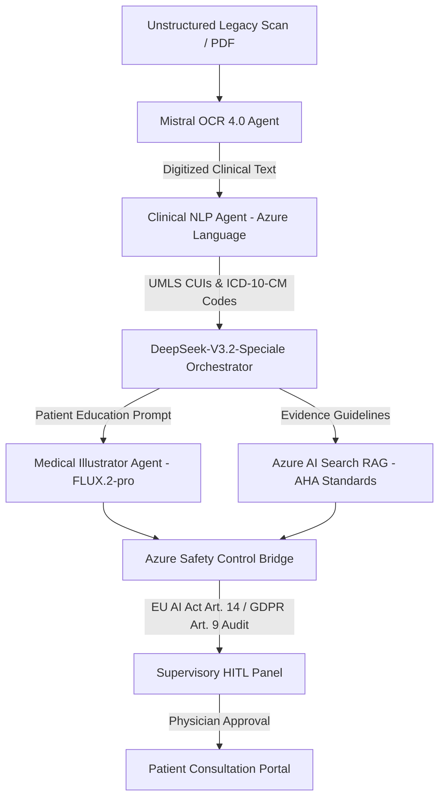

# OmniHealth AI: Legacy Document Synthesis & Patient Education Platform

[](https://azure.microsoft.com/)
[](https://mistral.ai/)
[](https://azure.microsoft.com/)
[](https://blackforestlabs.ai/)
[](https://ec.europa.eu/)

OmniHealth AI is a state-of-the-art **Multi-Agent Clinical AI Platform** built on the **Microsoft Agent Framework (MAF)**, **FastAPI**, **Azure AI Foundry**, and **React / Vite**. Designed specifically as a **Rule-Out / Screening Tool & Patient Literacy Engine**, it automates the digitization of messy, handwritten, or scanned hospital discharge summaries and generates non-intimidating, flat-vector anatomical visual illustrations using **FLUX.2-pro** for physician-patient consultation.

---

## 🔬 Clinical Architecture & Agent Workflow



### Multi-Agent Specialization (MAF Group Chat)

1. **Lead Medical Orchestrator (`DeepSeek-V3.2-Speciale / myagent`)**:
   - Manages workflow orchestration, normalizes unstructured clinical data, queries RAG indices for AHA guidelines, and synthesizes patient education summaries.
2. **Legacy Records Agent (`mistral-document-ai-2512`)**:
   - Parses handwritten referral notes, low-resolution hospital PDFs, and laboratory reports with layout preservation and multi-column OCR confidence scoring.
3. **Clinical NLP Agent (`Azure AI Language`)**:
   - Maps clinical entities to **UMLS CUIs** (Concept Unique Identifiers), **ICD-10-CM diagnostic codes**, and **ATC medication codes**.
4. **Medical Illustrator Agent (`FLUX.2-pro Text-to-Image`)**:
   - Generates non-intimidating, high-resolution 1024x1024 flat-vector anatomical diagrams suitable for patient education without graphic surgical imagery.
5. **Azure Safety Control Bridge**:
   - Enforces **EU AI Act Article 14** (Human Oversite) and **GDPR Article 9** (Health Data Processing) compliance guardrails before presenting recommendations.

---

## 📊 Pre-Configured Clinical Use Cases

| Patient ID | Clinical Condition | Record Type | ICD-10 | UMLS CUI | AI Progress | Status |
| :--- | :--- | :--- | :--- | :--- | :--- | :--- |
| **`PX-8810`** | Coronary Artery Disease (CAD - 85% Proximal LAD Stenosis) | Scanned Discharge Summary PDF | `I25.10` | `C0010054` | `88%` | `WAITING_APPROVAL` |
| **`PX-8811`** | Lumbar Disc Displacement (L5-S1 Herniation & Radiculopathy) | Handwritten Referral Note | `M51.26` | `C0020440` | `100%` | `APPROVED` |
| **`PX-8812`** | Type 2 Diabetes Mellitus with Peripheral Neuropathy | Scanned Lab & Clinical Report | `E11.40` | `C0011860` | `45%` | `PROCESSING` |

---

## ⚡ Technology Stack

### Backend
- **Framework**: Python 3.11+, FastAPI, Uvicorn
- **AI Orchestration**: Microsoft Agent Framework (MAF), Server-Sent Events (SSE)
- **Azure AI Foundry Services**:
  - `DeepSeek-V3.2-Speciale` (`myagent` endpoint)
  - `Mistral OCR 4.0` (`mistral-document-ai-2512`)
  - `FLUX.2-pro` (`blackforestlabs/v1/flux-2-pro`)
  - `Azure AI Language / Text Analytics for Health`
  - `Azure AI Search` (AHA RAG Index)

### Frontend
- **Framework**: React 18, Vite 5, TailwindCSS
- **Icons**: Lucide React
- **Typography**: Inter & JetBrains Mono (Clinical High-End Aesthetics)

---

## 🚀 Quickstart & Setup

### 1. Prerequisites
- Python 3.11 or higher
- Node.js 18+ and npm
- Azure AI Foundry API Key

### 2. Environment Configuration
Create a `.env` file in the root directory:

```env
AZURE_OPENAI_API_KEY=<YOUR_AZURE_AI_FOUNDRY_API_KEY>
AZURE_AGENT_ENDPOINT=https://wwefilip56-9387-resource.services.ai.azure.com/api/projects/wwefilip56-9387/agents/myagent/endpoint/protocols/openai/responses?api-version=v1
MISTRAL_OCR_ENDPOINT=https://wwefilip56-9387-resource.services.ai.azure.com/providers/mistral/azure/ocr
FLUX_PRO_ENDPOINT=https://wwefilip56-9387-resource.services.ai.azure.com/providers/blackforestlabs/v1/flux-2-pro?api-version=preview
```

### 3. Backend Setup
```bash
# Install Python dependencies
pip install -r requirements.txt

# Run FastAPI Server
python -m uvicorn core.api:app --port 8000 --reload
```

### 4. Frontend Setup
```bash
# Navigate to UI directory
cd ui

# Install dependencies
npm install

# Start Vite Dev Server
npm run dev
```

The React dashboard will be available at `http://localhost:5173` and the FastAPI backend at `http://localhost:8000`.

---

## 🧪 Testing & Verification

Run the end-to-end clinical use case test script:

```bash
python scripts/test_usecases.py
```

---

## 🛡️ Regulatory & Safety Compliance

OmniHealth AI incorporates a dedicated **Safety Control Bridge** to adhere to international medical AI regulations:
- **EU AI Act Article 14**: Ensures mandatory Human-in-the-Loop (HITL) approval prior to patient disclosure.
- **GDPR Article 9**: Enforces strict audit trails for special category health data.
- **AHA Health Literacy Standards**: Restricts generated illustration prompts to non-intimidating, flat-vector graphics without graphic surgical details.

---

## 📝 License

Distributed under the MIT License. See `LICENSE` for more information.
